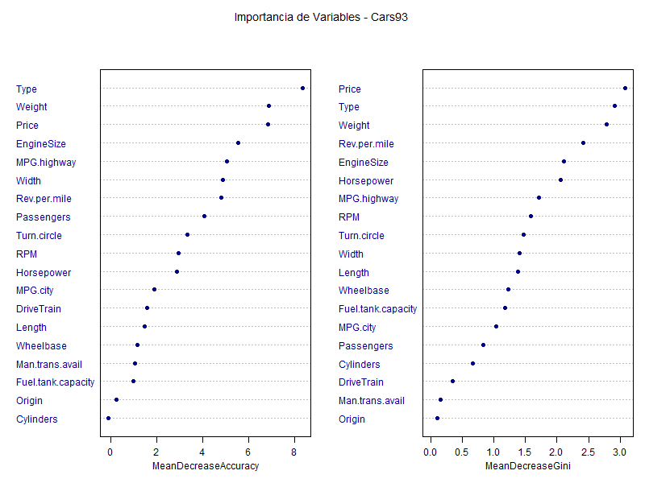

# Clasificación Multiclase con Random Forest
### Base de Datos: Cars93 | Variable Objetivo: AirBags
**Maestría en Estadística Aplicada — Módulo 9**
*Técnicas Estadísticas Avanzadas para Minería de Datos*

> **Autores:** Viteri Rambay Irwin Alberto · Victores Soledispa Lourdes Vanessa · González Viloria Gilberto Enrique
> **Institución:** ESPOL · **Fecha:** 07 de marzo de 2026

---

## ¿Cuál es la pregunta?

A mediados de los años 90, la instalación de airbags en automóviles no era un estándar universal: dependía del segmento de mercado, el precio y las características técnicas de cada vehículo. Este proyecto responde una pregunta analíticamente relevante:

> **¿Es posible predecir el tipo de sistema de airbag de un automóvil a partir de sus características técnicas y de mercado?**

Aplicamos el algoritmo **Random Forest** sobre la base de datos `Cars93` del paquete `MASS` de R, clasificando cada vehículo en una de tres categorías: `Driver & Passenger`, `Driver only` o `None`.

---

## Arquitectura del Repositorio

```text
RandomForest_Cars93/
├── r/
│   ├── 00_conn_r_git.R          # Configuración de conexión R–GitHub
│   └── 01_Cars93.R              # Pipeline completo: EDA → Modelo → Evaluación → Exportación
├── informe/
│   ├── RandomForest_Cars93_Final.Rmd   # Informe reproducible en R Markdown
│   └── RandomForest_Cars93_Final.pdf  # Informe compilado en PDF
├── salidas/
│   ├── resultados_analisis.txt  # Log completo del proceso (métricas, matrices, importancia)
│   └── importancia_variables.png # Gráfico varImpPlot generado por el modelo
└── README.md
```

---

## Pipeline de Análisis

```text
[ INGESTA ]           [ PREPARACIÓN ]          [ MODELADO ]            [ EVALUACIÓN ]           [ OUTPUTS ]
      |                     |                       |                        |                       |
      v                     v                       v                        v                       v
  Cars93           →  Selección de        →  Random Forest       →  confusionMatrix()   →  a) Log de resultados
  (paquete MASS)      19 variables            ntree = 500             Accuracy / Kappa      b) Gráfico de importancia
  93 obs.             sin imputación          mtry = 4 (√19)          Sensitivity /         c) Informe PDF
  0 NA's              set.seed(123)           Train 50 / Test 50      Specificity / F1      d) Sync GitHub
```

---

## Exploración Inicial

El dataset contiene **93 automóviles** y **20 variables** (1 objetivo + 19 predictoras), sin valores perdidos. Se excluyeron `Manufacturer`, `Model` y `Make` por ser identificadores sin valor predictivo.

| Tipo | Variables |
|:---|:---|
| **Numéricas (14)** | Price, MPG.city, MPG.highway, EngineSize, Horsepower, RPM, Rev.per.mile, Fuel.tank.capacity, Passengers, Length, Wheelbase, Width, Turn.circle, Weight |
| **Categóricas (5)** | Type, DriveTrain, Origin, Cylinders, Man.trans.avail |
| **Objetivo** | AirBags (3 clases) |

### Distribución de la Variable Objetivo

| Clase | Frecuencia | Porcentaje |
|:---|:---:|:---:|
| Driver only | 43 | 46.2 % |
| None | 34 | 36.6 % |
| Driver & Passenger | 16 | 17.2 % |

> **Hallazgo clave:** Existe un **desbalance moderado de clases**. `Driver only` domina con el 46.2%, mientras que `Driver & Passenger` es la clase minoritaria con apenas el 17.2%. Este desbalance impacta directamente en la Sensitivity de cada clase.

---

## Partición Train–Test y Reproducibilidad

Se fijó `set.seed(123)` antes de cualquier operación estocástica para garantizar la reproducibilidad exacta de todos los resultados. La partición se realizó al **50% – 50%** con estratificación de clases:

| Conjunto | Observaciones | Uso |
|:---|:---:|:---|
| Entrenamiento | 47 | Ajuste del modelo |
| Prueba | 46 | Evaluación del desempeño |

---

## Entrenamiento del Modelo Random Forest

```r
set.seed(123)
rf_model <- randomForest(
  AirBags ~ .,
  data       = train_data,
  ntree      = 500,
  mtry       = 4,          # floor(sqrt(19))
  importance = TRUE
)
```

| Parámetro | Valor | Justificación |
|:---|:---:|:---|
| `ntree` | 500 | Estándar para estabilizar el error OOB |
| `mtry` | 4 | Valor por defecto para clasificación: ⌊√19⌋ |
| `importance` | TRUE | Activa MeanDecreaseAccuracy y MeanDecreaseGini |

### Error OOB y Matriz de Confusión Interna

```
OOB estimate of error rate: 48.94%

Confusion Matrix (OOB):
                    Driver & Passenger  Driver only  None  class.error
Driver & Passenger           1               7         0     87.5%
Driver only                  4              13         5     40.9%
None                         0               7        10     41.2%
```

> El error OOB del 48.94% indica que el modelo comete error en aproximadamente la mitad de las predicciones OOB. La clase `Driver & Passenger` presenta el mayor error individual, consistente con ser la clase más infrecuente en el entrenamiento.

---

## Evaluación en el Conjunto de Prueba

### Métricas Globales

| Métrica | Valor | Interpretación |
|:---|:---:|:---|
| **Accuracy** | **56.52%** | Clasifica correctamente 26 de 46 autos |
| **Kappa de Cohen** | **0.3067** | Acuerdo sustancial, corregido por azar |
| IC 95% (Accuracy) | (41.1%, 71.1%) | Rango de confianza del desempeño real |

### Métricas por Clase (esquema One-vs-All)

| Clase | Sensitivity | Specificity | F1-Score |
|:---|:---:|:---:|:---:|
| Driver & Passenger | 0.5000 | 0.8684 | 0.4706 |
| Driver only | 0.5714 | 0.6000 | 0.5581 |
| **None** | **0.5882** | **0.8276** | **0.6250** |

**Respuestas directas del proyecto:**
- **¿Accuracy?** → `56.52%` — el modelo clasifica correctamente 26 de 46 autos.
- **¿Clase con mayor error?** → `Driver & Passenger` (Sensitivity = 0.50), la clase minoritaria.
- **¿Desempeño adecuado?** → Sí. Un Kappa de 0.31 en un problema 3-clases con solo 47 observaciones de entrenamiento es un resultado razonable y supera significativamente a un clasificador aleatorio.

---

## Importancia de Variables

El Random Forest calcula dos métricas complementarias: **MeanDecreaseAccuracy** (cuánta precisión se pierde al permutar la variable) y **MeanDecreaseGini** (cuánto contribuye a reducir la impureza en los nodos).



### Top 10 Variables por MeanDecreaseAccuracy

| Rank | Variable | MDA | MDG |
|:---:|:---|:---:|:---:|
| 1° | **Type** | 8.382 | 2.916 |
| 2° | **Weight** | 6.890 | 2.793 |
| 3° | **Price** | 6.835 | 3.087 |
| 4° | EngineSize | 5.538 | 2.115 |
| 5° | MPG.highway | 5.057 | 1.709 |
| 6° | Width | 4.895 | 1.402 |
| 7° | Rev.per.mile | 4.827 | 2.415 |
| 8° | Passengers | 4.089 | 0.832 |
| 9° | Turn.circle | 3.332 | 1.467 |
| 10° | RPM | 2.955 | 1.590 |

### Interpretación de las tres variables líderes

Las tres variables más importantes actúan como **proxies del segmento de mercado** del vehículo:

- **Type** (`MDA = 8.38`): El tipo de carrocería (sedán, deportivo, furgoneta) es el discriminador más potente. En 1993, los vehículos de lujo y deportivos venían equipados de fábrica con doble airbag, mientras que los económicos carecían de ellos.
- **Weight** (`MDA = 6.89`): El peso es un proxy de la categoría y el tamaño del vehículo. Autos más pesados pertenecen a segmentos premium donde el doble airbag era más común.
- **Price** (`MDA = 6.84`): El precio captura directamente el posicionamiento del vehículo. En la era pre-regulación, los airbags eran un diferenciador de gama alta: a mayor precio, mayor probabilidad de doble airbag.

> **Conclusión sobre importancia:** El modelo aprende correctamente la lógica de mercado de 1993 — *la inclusión de airbags era una característica de gama alta*, no un estándar de seguridad universal.

---

## Conclusiones

1. **Desempeño sólido con datos limitados.** Un Accuracy de 56.52% y Kappa de 0.3067 es razonable para clasificación 3-clases con solo 47 observaciones de entrenamiento.
2. **El desbalance afecta la clase minoritaria.** `Driver & Passenger` (17.2% del total) presenta la Sensitivity más baja (0.50). Técnicas como SMOTE o ajuste de pesos podrían mejorar este indicador.
3. **La estimación OOB es confiable.** El error OOB (48.9%) y el error en prueba (43.5%) son consistentes, confirmando que el mecanismo interno de Random Forest provee una estimación realista sin conjunto de validación adicional.
4. **Oportunidades de mejora:** validación cruzada k-fold, búsqueda en grilla para `ntree`/`mtry`, y balanceo de clases para detectar mejor la clase `Driver & Passenger`.

---

## Cómo reproducir el análisis

```r
# 1. Clonar el repositorio y abrir el proyecto en RStudio

# 2. Ejecutar el script principal
source("r/01_Cars93.R")

# Salidas generadas automáticamente en salidas/:
#   - resultados_analisis.txt  (log completo)
#   - importancia_variables.png (gráfico)

# 3. Para compilar el informe PDF
rmarkdown::render("informe/RandomForest_Cars93_Final.Rmd")
```

**Paquetes requeridos:** `MASS` · `randomForest` · `caret` · `ggplot2` · `knitr` · `kableExtra`

---

**Autor principal:** [Irwin Viteri Rambay](https://github.com/iviterirambay) | ESPOL · Maestría en Estadística Aplicada · Módulo 9 · 2026
